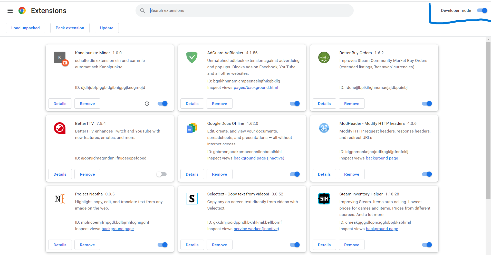

Its A Chrome extension that can watch a stream without you having to collect bonuses every 15 minutes. Additionally, it automatically places bets, allowing you to leave the tab open without any manual intervention.

# README Contents
---
1. [How to install](#how-to-install)
2. [How to customize the Extension](#how-to-customize-the-extension)
3. [How the code works](#how-the-code-works)

## How to install
1. Open the terminal and navigate to your desired destination, for example, the Desktop.
2. Clone the repository or download the ZIP file.
3. Open the folder and inside it, open `app.js` and change the keyword to match the language of your Twitch. For example if your Twitch language is english you need to change it to 'Predict'.
4. Go to your Chrome browser and open the extensions menu.

5. Activate the developer mode.

6. Click on "Load Unpacked" and select the folder that you copied from GitHub.

7. Open the stream you want to watch and let your PC/Laptop mine.

## How to customize the Extension

There are five things you can customize:
1. You can enable or disable the automatic collection of bonuses every 15 minutes.
2. You can enable or disable automatic betting.
3. You can decide what percentage of your channel points should be bet.
4. You can set the duration to wait before placing another bet (useful for streams that bet frequently).
5. You can choose which side to bet on (blue or pink).

## How the code works

The top variables are the ones you can customize as you like. I wouldn't recommend modifying the others unless you know what you're doing.
The `start()` function initiates the collection of bonuses and the betting function at an interval of 1 to 2 seconds.
The `clicking()` function checks every second if there is a bonus to collect and collects it if available.
The `bet()` function checks if there is an active bet, and if true, it places the bet and starts `getChannelpointNumber()`.
The `getChannelpointNumber()` function retrieves your current channel points amount and then starts `pressBtn()`.
The `pressBtn()` function clicks on the bet button on Twitch (blue or pink) as many times as you want (based on the percentage of your channel points).
